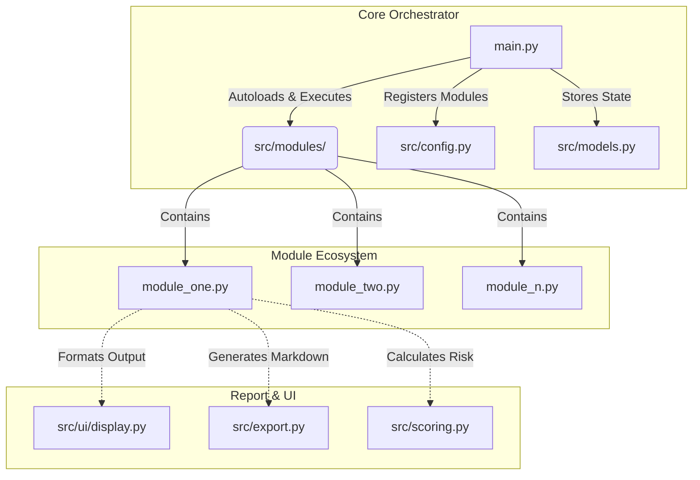
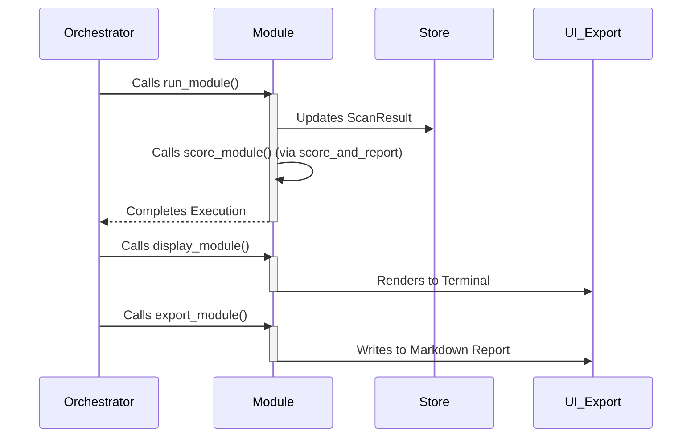

# Kythia-Claw (K-Vanguard) System Architecture

**Version:** 1.0.0-rc.1  
**Architecture Style:** Self-Contained Plugin / Addon-Based Autoloading

## 1. Core Philosophy
Kythia-Claw uses a **100% Modular Autoloading** architecture. 
To add a new feature (e.g., `bruteforce`), a developer or AI **ONLY** needs to create ONE file inside `src/modules/` (e.g., `src/modules/bruteforce.py`). 
The core engine (`main.py` and `export.py`) will automatically discover, execute, display, score, and export the module without needing to be heavily modified.

## 2. System Architecture Overview



## 3. The Module Anatomy (The Core Functions)
Every plugin file inside `src/modules/` MUST contain specific functions with precise naming conventions for the autoloader to hook into:

### A. The Runner (`run_<module_name>`)
Responsible for the core logic, scanning, and saving data to the `result` object.
```python
def run_example(target_url: str, hostname: str, result: ScanResult, progress, task) -> None:
    # 1. Update progress bar
    progress.update(task, description="[cyan]Example:[/cyan] Scanning...")
    
    # 2. Do the logic (use src.config.SESSION for HTTP requests)
    # ...
    
    # 3. Save to data model
    result.example_findings = {"status": "vulnerable", "data": [...]}
    
    # 4. Trigger Scoring (Mandatory)
    from src.scoring import score_and_report
    score_and_report(result, "example")
    
    # 5. Finish task
    progress.update(task, completed=50)
```

### B. The Scoring (`score_<module_name>`)
Responsible for calculating the security risk of the module's findings. Must return an integer between `0` (critically vulnerable) and `100` (perfectly secure).
```python
def score_example(result: ScanResult) -> int:
    findings = getattr(result, "example_findings", {})
    if not findings:
        return 100 # Safe
    if findings.get("status") == "vulnerable":
        return 0 # Critical
    return 80
```

### C. The Terminal UI (`display_<module_name>`)
Responsible for rendering the output to the terminal using the `rich` library. This must reside in the module file itself, NOT in a global UI file.
```python
from src.config import console, C
from rich.panel import Panel

def display_example(result: ScanResult) -> None:
    findings = getattr(result, "example_findings", {})
    if not findings:
        return # Skip if nothing found
    
    # Use rich library to print beautiful UI
    console.print(Panel(f"Found: {findings['data']}"))
```

### D. The Markdown Exporter (`export_<module_name>`)
Responsible for appending the module's findings into the final `.md` report.
```python
def export_example(result: ScanResult, W: callable) -> None:
    findings = getattr(result, "example_findings", {})
    W("## 💡 Example Module\n\n")
    if not findings:
        W("- ✅ No vulnerabilities found.\n\n")
        return
        
    W(f"- **Status:** {findings['status']}\n\n")
```

## 4. Module Execution Flow



## 5. Mandatory Integrations (Global Files)
When creating a new module, the AI/Developer must also update two global configuration files:

1. **`src/models.py`**: Add the new data field to the `ScanResult` dataclass.
   ```python
   example_findings: dict = field(default_factory=dict)
   ```
2. **`src/config.py`**: Register the module in the `SCAN_MODULES` list so the interactive menu can pick it up.
   ```python
   SCAN_MODULES = [
       ...
       ("example", "Example Scanner — Does something cool"),
   ]
   ```

## 6. Coding Standards & Best Practices
- **No Blocking Calls:** Use `ThreadPoolExecutor` for network-heavy tasks.
- **Stealth & Protection:** Always check `getattr(result, "waf_cdn", {})` before launching aggressive attacks.
- **Graceful Failures:** Catch all network exceptions. A module failing MUST NOT crash the entire scan.
- **Console Styling:** Use `src.config.C` for consistent color themes (e.g., `C['ok']`, `C['bad']`, `C['warn']`).
- **No Boilerplate:** Do NOT create `__init__.py` files or standard Python package structures for modules.